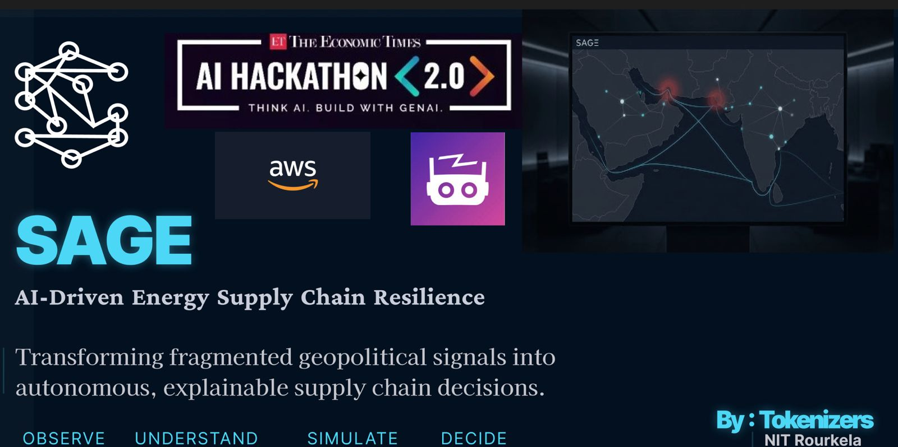

<div align="center">



# SAGE
AI-Driven Energy Supply Chain Resilience

### Synthesis-first Agentic Graph-Enhanced knowledge architecture for India's crude oil import risk

[](https://www.python.org/)
[](https://github.com/getzep/graphiti)
[](https://www.falkordb.com/)
[](https://aws.amazon.com/bedrock/)
[](https://langchain-ai.github.io/langgraph/)
[](LICENSE)

[](https://ridingbluewaves.hashnode.dev/engineering-sage-an-anticipatory-intelligence-system-for-indias-crude-oil-supply-chain)
[](http://44.213.136.64/)

</div>

---

## What SAGE Does

SAGE continuously ingests geopolitical and logistics signals from four always-on sensory sub-agents (AIS, news, sanctions, prices), synthesizes them into a bitemporal knowledge graph and a human-readable wiki store via a triage-gated Nova Pro pipeline, and autonomously triggers disruption modelling, procurement rerouting, and SPR drawdown recommendations — turning a reactive crisis response into a managed, anticipatory process with a 28× speedup from threshold crossing to ranked output.

---

## Engineering SAGE (The Deep-Dive Series)

A written walkthrough of the design decisions behind SAGE, each an introspective "why we did this, why we didn't do that" piece. Start with the overview, then dive into whichever decision interests you.

| # | Article | What it covers |
|---|---------|----------------|
| ▶ | **[Engineering SAGE — overview](https://ridingbluewaves.hashnode.dev/engineering-sage-an-anticipatory-intelligence-system-for-indias-crude-oil-supply-chain)** | The problem, the five-system architecture, and the four core bets. Start here. |
| 1 | **[Why raw signals never touch SAGE's vector store](https://ridingbluewaves.hashnode.dev/why-raw-signals-never-touch-sages-vector-store)** | Synthesis-first ingest and why a deterministic source-aware triage gate, not an LLM, routes every signal. |
| 2 | **[Why SAGE keeps two knowledge graphs, not one](https://ridingbluewaves.hashnode.dev/why-sage-keeps-two-knowledge-graphs-not-one)** | A computable Graphiti graph for machines, an editable wikilink graph for humans, and why every edge is bitemporal. |
| 3 | **[Answering a crisis in 50ms by computing a future that hasn't happened](https://ridingbluewaves.hashnode.dev/answering-a-crisis-in-50ms-by-computing-a-future-that-hasnt-happened)** | The anticipatory sandbox: speculative execution, the GNN surrogate, and the RISK_STATE isolation rule behind the 28× speedup. |
| 4 | **[from_pretrained, not fit: loading a worldview instead of simulating one](https://ridingbluewaves.hashnode.dev/frompretrained-not-fit-loading-a-worldview-instead-of-simulating-one)** | The versioned, provenance-tracked context bundle and the no-unsourced-row guarantee. |

---

## Table of Contents

1. [Why SAGE Stands Out](#why-sage-stands-out)
2. [Role in the SAGE System](#role-in-the-sage-system)
3. [Data Model](#data-model)
4. [Contracts](#contracts)
5. [System 1 — Sensory Agent Wiring Guide](#system-1--sensory-agent-wiring-guide)
6. [Tech Stack](#tech-stack)
7. [Getting Started](#getting-started)
8. [Instantiating Foundational Knowledge (Context Bundle)](#instantiating-foundational-knowledge-context-bundle)
9. [Upgrading the Knowledge Base to a New Bundle](#upgrading-the-knowledge-base-to-a-new-bundle)
10. [Team Ownership](#team-ownership)
11. [License](#license)

---

## Why SAGE Stands Out

| Property | Detail |
|---|---|
| **Synthesis-first ingest** | Raw signals never enter the vector store directly. Nova Pro reconciles every new signal against the current wiki page before `add_episode()` is called — the vector store holds synthesised, contradiction-resolved episodes, not raw facts. |
| **Anticipatory sandbox** | When risk crosses `elevated`, the sandbox forks a speculative future, runs the full ARIO cascade and procurement solver speculatively, and pre-stages results. When the crossing is confirmed, output appears in 300ms rather than 8,500ms (28× speedup). |
| **Bitemporal graph** | Every edge carries `observed_at` (when the event happened in the world) and `ingested_at` (when SAGE recorded it). `invalid_at IS NULL` = current fact. Old values are invalidated, never deleted. |
| **Source-aware triage** | AIS and price signals always route to `"extract"` (numeric, never prose). Sanctions always route to `"synthesize"`. News routes on cosine similarity. The routing decision is deterministic code, not an LLM call. |
| **Canonical entity registry** | 31 entities (22 routing entities + 9 crude grades), 153 aliases, 11 H3 cells. Three lookup indices: alias → entity_id, H3 cell → entity_id, price instrument → [entity_id]. No duplicate graph nodes; alias resolution happens before any LLM is invoked. |
| **Obsidian-style second brain** | Every entity has a git-versioned Markdown wiki page with YAML frontmatter and `[[Canonical Name]]` wikilinks. Opens natively in Obsidian; also parsed by the geospatial renderer for ArcLayer edges. |
| **No-hallucination risk scores** | Risk scores are expressed as prose sentences only (`_RISK_SENTENCE_TEMPLATE`). The synthesis prompt explicitly bans `"Current risk score:"` labels — prevents Nova Lite from inventing schema-less edge types. |

---

## The Learning Cascade (A Second Brain That Grows)

SAGE's risk model is not a set of isolated per-node scores, and its dependency
graph is not static config. It is a **self-improving knowledge structure**: risk
propagates through the graph along real, weighted dependencies, and those weights
are **refined from live signals** — the clearest expression of the "second brain".

**1. Risk cascade (not isolated scores).**
Fusion assigns a *primary* risk to an entity from its own signals
(`knowledge/ingest_queue.py`). The cascade (`knowledge/cascade.py`) then propagates
that risk to everything that **depends** on it — refineries a corridor exposes,
ports it feeds, suppliers that export through it — via `EXPOSES` / `FEEDS` /
`SUPPLIES` / `EXPORTS_VIA` edges. One CRITICAL Strait of Hormuz lights up its whole
dependent chain, each cascaded score tagged `cascade-v1` with the source and path.

**2. Exposure-weighted, from sourced data.**
Propagation is weighted by the **real** dependency share on each edge
(`throughput_share_pct` in the `.context` bundle — e.g. `Hormuz→Vadinar 0.42`,
`Hormuz→Sikka 0.45`, PPAC/derived, cited). A port 45%-dependent on Hormuz inherits
more risk than one 42%-dependent — not a flat decay. Every node also carries
`prov_source_url` so each value traces to its citation.

**3. The LLM learns the weights bitemporally (`knowledge/edge_learning.py`).**
When a live System-1 signal implies a dependency change ("Vadinar cuts Hormuz
intake to ~25% after rerouting via the Cape"), the synthesis LLM **detects and
extracts** the new share and writes it **bitemporally** — the prior value is kept
with the time it was superseded, the new value stamped `tier="learned"` with the
**source signal** as provenance. The cascade then propagates risk using the updated
weight. The LLM **reconciles evidence into a number; it never invents one** — the
detector only fires when a signal genuinely describes a change.

```
seed (.context, sourced)  →  reconciled onto edges  →  cascade reads weights
        ▲                                                      │
        │  bitemporal update, cited to the signal              ▼
   LLM reconciles  ◄──  live System-1 signal implies a dependency shift
```

So the dependency graph **starts from sourced seed knowledge and evolves from real
observation**, every version traced to either `.context` (seed) or a specific
signal (learned). Risk propagation gets more accurate as the brain accumulates
evidence — a knowledge base that learns, not a database that stores.

---

## Role in the SAGE System

```
  sensory_agent/ (System 1)
  ├── ais.py          → AIS websocket, H3 indexing, dark-vessel detection
  ├── news.py         → GDELT + NewsAPI every 15 min; Nova Micro entity extraction
  ├── sanctions.py    → OFAC/EU/UN diff every 6h; force_synthesis=True always
  └── prices.py       → yfinance every 5 min; BOCD changepoint detection
           │  NormalizedSignal → Redis queue
           ▼
  knowledge/ingest_queue.py
  ├── fusion model (_FeatureVector, 17-dim)
  ├── triage gate (source-aware routing: extract / synthesize / store / drop)
  └── write_risk_state() every 30s flush
           │
           ▼
  ┌────────────────────────────────────────────┐
  │          SAGE Knowledge Base               │
  │  Store 1: episodic (Graphiti episodes)     │
  │  Store 2: semantic graph (FalkorDB nodes   │
  │           + edges + 1024-D embeddings)     │
  │  Store 3: /wiki (Markdown pages,           │
  │           YAML frontmatter, [[wikilinks]]) │
  └───────────────────┬────────────────────────┘
                      │  typed read API only
     ┌────────────────┼────────────────┐
     ▼                ▼                ▼
  scenario_agent/  alt_procurement/  reserve_optim/
  (ARIO cascade)   (OR-Tools MILP)   (Bellman SDP)
                      │
                      ▼
                visualizer_agent/
                (FastAPI + deck.gl digital twin)
                      │
                      ▲
           orchestration/ (LangGraph)
           monitor → sandbox → triggers
           SENSE→TRIAGE→SAGE→SANDBOX→SCENARIO→PROCURE→RESERVE
```

The knowledge base is the single source of truth — System 1 is the sole writer of raw signals; Systems 2–5 are pure consumers via `knowledge/api/read.py`. No agent imports `graphiti_core`, `falkordb`, or any `knowledge/` internal directly.

---

## Data Model

### Three Stores

| Store | What | Where | Written by |
|---|---|---|---|
| **Episodic** | Every synthesised episode node with body text + `reference_time`. Non-lossy provenance ledger. | FalkorDB (Graphiti-managed) | `add_episode()` only |
| **Semantic graph** | Typed entity nodes + typed edges + 1024-D embeddings + bitemporal validity windows (`valid_at` / `invalid_at`). | FalkorDB (Graphiti-managed) | `add_episode()` only |
| **/wiki store** | One Markdown file per entity. YAML frontmatter + `[[Canonical Name]]` wikilinks + `links_out` list. Git-versioned. | `knowledge/wiki/` | `write_wiki_page()` only, after `add_episode()` succeeds |

### Entity Types

| Type | Count | Examples |
|---|---|---|
| `Corridor` | 4 | Strait of Hormuz, Bab-el-Mandeb, Suez Canal, Strait of Malacca |
| `Supplier` | 5 | Saudi Aramco, NIOC, ADNOC, Rosneft, Iraqi Oil Ministry |
| `Refinery` | 3 | Jamnagar Refinery, Mangaluru, Paradip |
| `Port` | 4 | Vadinar, Yanbu, Sikka, Fujairah |
| `SPRCavern` | 3 | Vizag SPR, Mangaluru SPR, Padur SPR |
| `Authority` | 3 | OFAC, EU, UN |
| `Vessel` | dynamic | registered at runtime via `register_vessel()` |
| `GeoEvent` | dynamic | `[[AIS Anomaly — Larak Cluster]]`, `[[2019 Tanker Attacks]]` |
| `PendingScenario` | dynamic | speculative futures from sandbox |
| `ScenarioOutput` | dynamic | ARIO results |
| `CrudeGrade` | static | Arab Light, Basra Heavy, etc. |

### Edge Types

| Edge | From → To | Key Attributes |
|---|---|---|
| `RISK_STATE` | Corridor / Supplier / Refinery → itself | `score`, `band`, `factor_ais`, `factor_gdelt`, `factor_price`, `factor_sanctions`, `rationale` |
| `EXPORTS_VIA` | Supplier → Corridor | `daily_export_mbpd`, `throughput_share_pct` |
| `FEEDS` | Corridor → Refinery / Port | `throughput_share_pct` |
| `SUPPLIES` | Supplier → Refinery | `grade`, `daily_export_mbpd` |
| `CONFIGURED_FOR` | Refinery → CrudeGrade | `compatibility_score`, `gravity_range_api` |
| `SANCTIONED_BY` | Vessel / Supplier → Authority | `effective_date`, `list_name` |
| `BYPASS_ROUTE` | Corridor → Corridor | `capacity_mbpd`, `lead_time_days` |
| `FEEDS_RESERVE` | Supplier / Port → SPRCavern | `fill_rate_mmt_day` |
| `AFFECTS_SCENARIO` | Corridor → ScenarioOutput | `gap_mbpd`, `confidence` |

### Wiki Frontmatter Schema

```yaml
---
entity_id:       corridor_hormuz
entity_type:     Corridor
risk_score:      0.67
risk_band:       elevated
factors:
  ais:           0.80
  gdelt:         0.55
  price:         0.60
  sanctions:     0.20
last_updated:    2026-02-26T14:32:00Z
valid_at:        2026-02-26T14:00:00Z
source_episodes: []
coordinates:     {lat: 26.5, lon: 56.4}
links_out:       [supplier_aramco, refinery_jamnagar, port_vadinar]
---
```

---

## Contracts

All inter-agent contracts live in `contracts/` and import nothing from the rest of the codebase — they are pure Pydantic schema. This is the strict boundary that allows every system to be built in parallel without coupling.

**`NormalizedSignal`** (`contracts/signal.py`) is System 1's only output type. It carries the signal source, timestamps (both `observed_at` for when the event happened in the world and `ingested_at` for when the sub-agent emitted it), `entity_refs` (canonical display names from the registry), a one-line `summary` that becomes the triage embedding input, `force_synthesis` to bypass the similarity gate, and a `payload` dict for source-specific fields. Every sub-agent emits this type; the KB consumer accepts nothing else.

**`ScenarioOutputData`** (`contracts/outputs.py`) is System 2's output. It encodes the ARIO disruption model result: supply gap in mbpd, gap duration, day-by-day feedstock gap timeline, price impact bounds, SPR depletion projection, and a `status` field (`"speculative"` when produced by the sandbox, `"confirmed"` when produced from a live crossing). Systems 3 and 4 read this to scope their work.

**`ProcurementRecData`** (`contracts/outputs.py`) is System 3's output. It contains a TOPSIS-ranked list of alternative procurement options, each with supplier, grade, corridor, landed cost, lead time, grade compatibility score, and rationale. System 5 renders this directly in the copilot recommendations panel.

**`SPRScheduleData`** (`contracts/outputs.py`) is System 4's output. It encodes a day-by-day draw/hold/refill plan for India's three SPR caverns, the probability the buffer constraint is satisfied, and a policy memo for the System 5 copilot to cite.

**`contracts/bands.py`** defines the five risk bands (`calm · watch · elevated · action · critical`) and their score thresholds. The orchestration monitor, the triage gate, and the UI colour mapping all import from this single source — changing a threshold here propagates everywhere automatically.

The contracts are the freeze boundary. If any field name changes after System 1 and System 2 are both in development, serialization breaks silently at runtime. Treat `contracts/` as append-only once two or more systems depend on it.

---

## System 1 — Sensory Agent Wiring Guide

System 1 is the **sole producer** of raw signals. Sub-agents push `NormalizedSignal` onto the Redis queue via `push_signal()` — they never call `ingest_signal()` or `write_risk_state()` directly.

### Entity Resolution

Before emitting any signal, populate `entity_refs` with canonical display names from the entity registry. Wrong names create duplicate graph nodes.

```python
from knowledge.registry import resolve_h3, resolve_instrument, resolve_name, canonical_name

# AIS: H3 cell → entity
entity_id = resolve_h3("8a2a1072b59ffff")       # → "corridor_hormuz"
display    = canonical_name(entity_id)            # → "Strait of Hormuz"

# Price: ticker → entities
entity_ids = resolve_instrument("BZ=F")           # → ["corridor_hormuz", "corridor_bab_el_mandeb"]
displays   = [canonical_name(eid) for eid in entity_ids]

# Sanctions / News: free-form name → entity
entity_id = resolve_name("Hormuz Strait")         # → "corridor_hormuz"  (alias lookup)
display    = canonical_name(entity_id)            # → "Strait of Hormuz"
```

**Canonical names — the 22 routing entities** (sub-agents resolve these via H3/instrument/name; 9 crude grades also registered):

| Category | Canonical names |
|---|---|
| Corridors | `"Strait of Hormuz"`, `"Bab-el-Mandeb"`, `"Suez Canal"`, `"Strait of Malacca"` |
| Suppliers | `"Saudi Aramco"`, `"NIOC"`, `"ADNOC"`, `"Rosneft"`, `"Iraqi Oil Ministry"` |
| Refineries | `"Jamnagar Refinery"`, `"Mangaluru"`, `"Paradip"` |
| Ports | `"Vadinar"`, `"Yanbu"`, `"Sikka"`, `"Fujairah"` |
| SPR sites | `"Vizag SPR"`, `"Mangaluru SPR"`, `"Padur SPR"` |
| Authorities | `"OFAC"`, `"EU"`, `"UN"` |

### Sub-Agent Rules

| Sub-agent | Push trigger | `force_synthesis` | Frequency |
|---|---|---|---|
| **AIS** | Anomaly cluster detected (gap > 4h or dark vessels); NEVER per position ping | Always `False` | 0–10/hr normal, up to 50/hr during crisis |
| **News** | Per article, after Nova Micro finds ≥1 resolved entity; discard unresolved | Always `False` | 0–20 per 15-min cycle |
| **Sanctions** | Immediately on any diff (add or remove); both adds and removals matter | Always `True` | 0–5 per 6h cycle; up to 20+ during burst |
| **Price** | BOCD changepoint or sustained regime shift only; normal ticks never pushed | Always `False` | 0–3/day calm; up to 15/day crisis |

**New vessels (sanctions sub-agent):** call `register_vessel(mmsi, name)` before `push_signal()` so the new entity resolves correctly in the next news article.

### `_FeatureVector` — Fusion Model Interface

```python
@dataclass
class _FeatureVector:
    ais_gap_count_24h:          float   # AIS gaps > 4h in last 24h
    ais_dark_vessel_count:      float
    ais_anomaly_score_max:      float   # max HABIT score (0..1)
    ais_gap_duration_max_h:     float
    ais_monitored_cell_pct:     float   # % of tracked H3 cells with activity
    ais_velocity_std:           float
    gdelt_tone_24h_mean:        float   # negative = hostile
    gdelt_tone_delta:           float
    news_severity_max:          float   # 0..1
    news_event_count_24h:       float   # count of severity > 0.7 events
    price_brent_pct_change_24h: float
    price_bocd_flag:            float   # 1.0 if BOCD breakpoint detected
    price_regime:               float   # 1.0 if regime = stressed
    price_war_risk_premium:     float   # 0..1
    sanctions_new_additions_24h: float
    sanctions_vessel_count:     float
    sanctions_major_entity:     float   # 1.0 if major state entity sanctioned
```

### Fusion Model Calibration (GBM v1 — LOCO-5 validated)

The fusion model is a **GradientBoostingClassifier + Platt scaling** trained to
predict `within_24h_of_crossing` — whether the current 17-dim `FeatureVector`
is within 24 hours of a documented threshold-crossing disruption event.

#### Validation results

| Held-out crisis | LOCO AUC |
|---|---|
| 2019 Gulf of Oman tanker attacks | 0.7500 |
| 2021 Suez Ever Given blockage | 0.6667 |
| 2022 Ukraine war energy shock | 0.9394 |
| 2025 US-Iran Hormuz standoff | 1.0000 |
| 2026 Hormuz closure (golden path) | 0.8333 |
| **Mean LOCO AUC** | **0.8379** |

Each row: train on the other four crises, test on the held-out one — these are
genuine out-of-sample numbers, not training-set fit.

#### How it was built

```
scripts/build_calibration_data.py
```

For each of the five crisis windows in `contracts/bands.py`:

- **Price features** — real Brent/WTI daily close from `yfinance` (`BZ=F`), 30-day
  lookback for baseline and war-risk premium calculation.
- **GDELT tone** — analytic sigmoid interpolation anchored to GDELT DOC API spot
  samples (`gdeltproject.org/api/v2/doc`). Ramps hostile during approach, recovers
  after crossing.
- **AIS features** — honest proxy from dated IMO/UKMTO incident timelines;
  interpolated between documented events. Not a fabricated continuous feed.
  Per-tick `provenance.ais` notes this explicitly.
- **Sanctions features** — OFAC/UN press release dates (public record); sparse
  binary event flags.
- **Label** — `within_24h_of_crossing = 1` for ticks inside ±24 h of the
  documented disruption onset; 0 otherwise. 140 total ticks, 15 positive.

The model file is at `sensory_agent/fusion_model.pkl`; it contains
`{model, explainer, meta}`. When the pkl exists, `fusion.py` uses GBM predictions
and SHAP factor attributions; when absent it falls back to `weighted-sum-fallback`
(clearly labelled in all API responses).

Full validation report: [`docs/CALIBRATION_REPORT.md`](docs/CALIBRATION_REPORT.md)

To retrain (e.g. after adding a new crisis window):

```bash
python3.10 scripts/build_calibration_data.py
# Deletes demo_cache/*.json to force re-fetch, or reuses cached JSONs.
# Writes sensory_agent/fusion_model.pkl + docs/CALIBRATION_REPORT.md.
```

#### Action threshold

The Youden-J optimal threshold is **0.2636** (probability ≥ this → `ACTION` band
trigger). Sensitivity 1.00, specificity 1.00 on the full training set; LOCO mean
AUC 0.84 is the honest out-of-sample claim.

---

### Build Checklist

- [ ] Sub-agent calls only `push_signal()` — never `ingest_signal()` or `write_risk_state()`
- [ ] AIS: `resolve_h3()` → `canonical_name()` for `entity_refs`; push per anomaly cluster, never per ping
- [ ] Price: `resolve_instrument()` → `canonical_name()`; push only on BOCD changepoint or regime shift
- [ ] Sanctions: `resolve_name()` → `register_vessel()` for new MMSI before push; `force_synthesis=True` always
- [ ] News: Nova Micro extraction → `resolve_name()` for each candidate → discard unresolved
- [ ] `observed_at` = when the event happened in the world, not when your sub-agent detected it
- [ ] `signal_id` = ULID or UUID, unique per emission
- [ ] `raw_ref` = S3 key or DB ID of verbatim raw record
- [ ] Container calls `await kb_init()` before the first `push_signal()`

---

## Tech Stack

| Layer | Technology | Role |
|---|---|---|
| Graph database | FalkorDB | Stores Graphiti episodic nodes, typed edges, embeddings |
| Knowledge graph | `graphiti-core[falkordb]` | Bitemporal episode management, semantic search, entity extraction |
| LLM (synthesis) | Amazon Bedrock — Nova Pro | Wiki reconciliation, contradiction resolution, wikilink generation |
| LLM (extraction) | Amazon Bedrock — Nova Micro | Entity name extraction from news articles (low-cost, high-frequency) |
| LLM (copilot) | Amazon Bedrock — Nova Pro | EA-GraphRAG copilot queries from System 5 |
| Embeddings | Amazon Bedrock — Titan Embed v2 | 1024-D episode and entity embeddings |
| Orchestration | LangGraph | Autonomous pipeline loop: SENSE→TRIAGE→SAGE→SANDBOX→SCENARIO→PROCURE→RESERVE |
| Disruption model | Custom ARIO (Hallegatte 2008) | Day-by-day IO cascade; PyTorch GraphSAGE surrogate (<150ms) |
| Procurement solver | OR-Tools MILP | Alternative supplier routing under corridor constraints |
| Reserve optimisation | Bellman SDP + real-options | Optimal SPR drawdown schedule under uncertainty |
| Queue | Redis | Sensory agent → ingest queue; decouples sub-agents from KB consumer |
| API gateway | FastAPI + WebSocket | Risk score push, copilot, wiki endpoints for System 5 frontend |
| Frontend | React + deck.gl | Geospatial H3 heatmap, ArcLayer edges, pipeline bar, copilot panel |
| Geospatial indexing | H3 (Uber) | res-10 cell indexing for AIS anomaly clustering and dedup |
| Language | Python 3.11+ | All backend systems |
| Schema | Pydantic v2 | All inter-agent contracts; validated at system boundaries |
| Wiki format | Markdown + YAML frontmatter | `[[wikilinks]]`, `links_out` frontmatter; Obsidian-native |

---

## Deployment on Amazon EC2

SAGE runs as a single Docker Compose stack, which made the deployment decision
mostly about *where* to run containers reliably and cheaply — not about
picking a specialised platform. EC2 was the natural fit for a few reasons:

- **The stack is already container-native.** Every SAGE component — FalkorDB,
  Redis, the KB core, the API gateway, the System 1 sensory agents, the React
  frontend — ships as a Docker image with a single `docker-compose.yml`
  wiring them together. EC2 is just a Linux box that runs that same Compose
  file unmodified; there's no re-platforming onto a managed container service
  (ECS/EKS) required to get a working deployment, which keeps the path from
  "runs on my laptop" to "runs on the internet" short and low-risk.
- **CPU-only, modest footprint.** SAGE's "AI" is mostly classical operations
  research (ARIO cascade, MILP procurement, Bellman SDP reserve optimisation)
  plus LLM calls that go *out* to Amazon Bedrock rather than running locally.
  That means the instance itself never needs a GPU — a burstable, low-cost
  **t3.medium** (2 vCPU / 4 GiB) comfortably runs the full live system,
  including the AIS/news/price/sanctions sensory agents. Right-sizing this
  cheaply is one of the clearer wins of EC2 over paying for managed
  container/serverless compute priced for spikier or GPU-bound workloads.
- **Bedrock lives one hop away, not a network hop away.** Since SAGE's LLM
  layer (Nova Pro/Micro synthesis, Titan embeddings) is already Amazon
  Bedrock, running the app itself on AWS keeps the whole request path inside
  one cloud — lower latency to Bedrock, and the option to authenticate via an
  **IAM instance role** instead of long-lived static keys sitting in a config
  file, when Bedrock and the compute share an account.
- **Bind-mounted state, EC2's EBS volume as the disk.** FalkorDB's graph,
  Redis's AOF log, the wiki markdown store, and the feedback/scenario-outcome
  ledgers all persist to the instance's root EBS volume. A single instance
  with a persistent disk is the simplest storage model available for a
  system whose "memory" — literally, the knowledge graph — needs to survive
  restarts and redeploys; that persistence guarantee is what an EBS-backed
  EC2 instance gives you by default, without wiring up a separate managed
  database service.
- **Security posture stays legible.** One instance behind one security group
  is easy to reason about: a public-facing app only needs port 80/443 open,
  everything else (the API port, the graph browser, SSH) stays firewalled to
  the operator. That's a much smaller, easier-to-audit surface than a
  multi-service managed architecture would require for an equivalent
  single-tenant deployment.
- **Headroom to grow without a rewrite.** Nothing about this deployment is a
  dead end — the same images can be pushed to ECR and run on ECS/Fargate
  later if SAGE needs to scale beyond one box (e.g. separating the always-on
  System 2/3/4 agents onto their own containers), without changing a line of
  application code. EC2 is the pragmatic starting point, not a ceiling.

In short: SAGE's own architecture — Dockerized, CPU-only, Bedrock-backed,
stateful via a persistent graph — maps cleanly onto what a single EC2
instance is good at, so that's what it runs on. See
[`docs/DEPLOY_EC2.md`](docs/DEPLOY_EC2.md) for the concrete instance sizing,
security group, and bring-up steps.

---

## Getting Started

### Prerequisites

- Python 3.11+
- Docker + Docker Compose
- AWS CLI configured with Bedrock access, region `us-east-1` (or `ap-south-1`)
- The following API keys available before starting:

| Key | Used by |
|---|---|
| `AISSTREAM_API_KEY` | sensory_agent/ais.py |
| `EIA_API_KEY` | sensory_agent/prices.py |
| `NEWSAPI_KEY` | sensory_agent/news.py |
| `AWS_ACCESS_KEY_ID` / `AWS_SECRET_ACCESS_KEY` | Amazon Bedrock (Nova Pro, Titan Embed) |
| `FALKORDB_PASSWORD` | knowledge/connection.py |
| `REDIS_URL` | knowledge/ingest_queue.py |

### Install

```bash
pip install -e ".[dev]"
```

### Environment Variables

```bash
cp .env.example .env
# Fill in: FALKORDB_PASSWORD, AWS_ACCESS_KEY_ID, AWS_SECRET_ACCESS_KEY,
#          AWS_REGION, AISSTREAM_API_KEY, EIA_API_KEY, NEWSAPI_KEY, REDIS_URL
```

| Variable | Default | Purpose |
|---|---|---|
| `DEMO_MODE` | `false` | `true` replays `demo_cache/` instead of hitting live APIs |
| `AWS_REGION` | `us-east-1` | Bedrock region |
| `FUSION_FLUSH_INTERVAL_S` | `30` | Seconds between `write_risk_state()` flushes |

### Start Infrastructure

```bash
docker compose up falkordb redis -d
```

### Smoke Test

```bash
python3.11 -c "
from knowledge.connection import init
from knowledge.registry import REGISTRY, resolve_h3, canonical_name
import asyncio
asyncio.run(init())
print('Registry:', len(REGISTRY), 'entities')
print('Hormuz H3 lookup:', canonical_name(resolve_h3('8a2a1072b59ffff')))
"
# Expected: Registry: 31 entities
#           Hormuz H3 lookup: Strait of Hormuz
```

### Start Everything

```bash
docker compose up
```

### Demo Mode (no live API keys needed)

```bash
DEMO_MODE=true docker compose up
# Replays pre-recorded Feb 23–28 2026 Hormuz closure timeline from demo_cache/
```

### One-Time KB Init (all containers)

```python
from knowledge.connection import init as kb_init
await kb_init()   # idempotent — call once at container boot before any KB call
```

---

## Instantiating Foundational Knowledge (Context Bundle)

Before any live signal arrives, SAGE is **instantiated** with a foundational knowledge snapshot — the
geopolitical entities and the relationships between them. This is to SAGE what pretrained weights are
to a model: a **load**, not a train (`from_pretrained`, not `fit`). Live signals (System 1) then layer
continual updates on top.

The knowledge lives in a versioned, provenance-tracked **context bundle** with **three layers**
(61 entities: corridors, suppliers, refineries, crude grades, ports, SPR caverns, authorities, and
historical geopolitical events):

```
data/india-energy-2026.context/        # the bundle ("knowledge2026")
├── manifest.yaml                       # metadata, source registry, estimation methods
├── facts/                              # LAYER 1 — structured ground truth (CSVs)
│   ├── nodes/*.csv                     #   incl. authorities.csv, geo_events.csv (history)
│   └── edges/*.csv                     #   EXPORTS_VIA, FEEDS, SUPPLIES, CONFIGURED_FOR, BYPASS_ROUTE
├── sources_index.csv                   # entity_id → authoritative URLs
├── sources/<entity_id>.md              # LAYER 2 — real fetched evidence (grounding text)
└── narratives/<entity_id>.md           # LAYER 3 — per-entity prose with [[wikilinks]] (optional)
```

**Three kinds of knowledge, loaded differently:**

| Layer | Example | How it loads |
|---|---|---|
| **Facts** (CSV) | `Jamnagar capacity = 1.40 mbpd`, `Arab Light API = 32.8` | Written **directly** as graph attributes. Deterministic — no LLM "reconciles" a known number. |
| **Sources** (fetched text) | the Wikipedia/EIA article behind an entity | The **grounding evidence** the LLM summarises (RAG) — prevents hallucination. |
| **Narratives** (Markdown) | "Why Hormuz is critical; its tie to `[[Saudi Aramco]]`" | Routed through the **synthesis path** — the same one System 1 uses for live signals. |

Every facts row carries a `tier` (`real` / `derived` / `estimated`) and a `source` — the loader
**rejects any unsourced row**, the machine-checked "no simulated data" guarantee.

**How instantiation populates all three stores.** `bundle.instantiate(g)` runs three phases:

```
Phase 1 — FACTS       facts/*.csv ──► structural episodes ──► add_episode()
                                                              → Store 1 (episodic) + Store 2 (graph attrs)

Phase 2 — NARRATIVES  body = hand-authored | source-grounded (Nova Pro over sources/) | facts-only | stub
                      render_wiki_page() ──► write_wiki_page()  → Store 3 (wiki)
                                        └─► add_episode(body)   → Stores 1 + 2 (relations + vectors)

Phase 3 — CANONICALIZE  dedup RELATES_TO edges + merge alias-variant nodes (vs the registry)
```

Phase 2 narratives go through the **same synthesis machinery System 1 uses** (reconciled prose,
`[[wikilinks]]`, `links_out` relations). The authoring precedence is **hand-authored → source-grounded
→ facts-only → stub**, so the wiki store is always fully covered and entities with fetched evidence are
grounded in real text. Phase 3 removes the duplicate edges / alias-variant nodes that LLM extraction
otherwise leaves behind.

> **Authoring vs distribution.** The `.context` bundle is the human-authored *source* (facts + prose) —
> diffable, swappable, easy to contribute to. Instantiation reconciles it through the pipeline. (A
> future `export_baked()` can snapshot the reconciled state for deterministic fast loading — the true
> "frozen weights" — but the source bundle stays the canonical, editable artifact.)

### Instantiate (the two-command workflow)

```bash
# 1. Infrastructure up (FalkorDB stores the graph+vectors under knowledge/graph_store)
docker compose up falkordb redis -d

# 2. Fetch the bundle's source evidence → sources/<entity_id>.md  (real text for RAG grounding)
python scripts/fetch_sources.py data/india-energy-2026.context

# 3. Instantiate: facts → graph attributes; narratives → synthesis → wiki + graph + vectors.
#    Run against LIVE Bedrock — the stub LLM neither extracts typed fields nor synthesises prose.
FALKORDB_HOST=localhost LLM_PROVIDER=bedrock \
  python scripts/sage_instantiate.py data/india-energy-2026.context
```

The CLI shows a live loader (phase · entity · progress bar) and a read-back of the wiki page count
and graph risk states. Flags: `--no-llm-author` (deterministic stubs instead of LLM narratives),
`--facts-only` (skip narratives/wiki).

**Grounding (anti-hallucination):** for an entity with cached source text in `sources/`, the LLM
writes the narrative **only from that text + the structured facts** — it does not draw on parametric
memory. Precedence per entity: hand-authored `narratives/*.md` → source-grounded → facts-only → stub.

**Library API** (what the CLI calls under the hood):

```python
from knowledge.context import load_bundle
bundle = load_bundle("data/india-energy-2026.context")   # parses + validates provenance
counts = await bundle.instantiate(g, author_missing_with_llm=True)   # {facts, narratives}
```

**Swap the worldview** by pointing at a different bundle — by year (`india-energy-2027.context`),
region (`europe-gas-2026.context`), or domain. Build your own with the format spec:
[`data/CONTEXT_BUNDLE_SCHEMA.md`](data/CONTEXT_BUNDLE_SCHEMA.md). Full sourcing rationale per value:
[`docs/data.md`](docs/data.md).

> **Refresh cadence:** most of a bundle changes once a year (refinery capacity, assays, import shares)
> or never (coordinates, distances). Pull once, commit, version as a new dated bundle — don't build
> scrapers for annual data. A handful of values drift faster (Brent, freight, SPR fill, Hormuz share):
> these are listed explicitly in [`params/volatile_defaults.csv`](data/india-energy-2026.context/params/volatile_defaults.csv)
> with their cadence and the System 1 signal that overrides them live. Anything event-driven (risk
> scores, congestion, sanctions, war-risk premium) is System 1's job, never the static bundle.

---

## Upgrading the Knowledge Base to a New Bundle

When a new `.context` bundle is available (e.g. `india-energy-2027.context` with updated refinery capacities, new suppliers, revised TOPSIS weights), you can apply it **without losing any dynamic KB data** — RISK_STATE edges, GeoEvent nodes, live episodes from System 1, and wiki pages written by the synthesis path are all preserved.

### What the upgrade replaces vs. preserves

| Layer | Action |
|---|---|
| **Structural facts** — node attributes (capacity, assay, throughput), edge weights (volume, share, compatibility), model params (ARIO, routing, TOPSIS, SPR/SDP, grade, heuristic, economics) | **REPLACED** — upserted from the new bundle's CSVs |
| **RISK_STATE edges** — live risk scores, factor breakdowns, rationale strings | **PRESERVED** — written by System 1, never touched by the upgrade |
| **GeoEvent nodes, Vessel nodes** — dynamic entities registered at runtime | **PRESERVED** |
| **Graphiti episodes** — every event the system has ever processed | **PRESERVED** |
| **Wiki narratives from System 1** — synthesised pages for live signals | **PRESERVED** |
| **Wiki pages for changed entities** | **RE-SYNTHESIZED** — a `## Context Update` note is appended with the new structural facts; the rest of the page is unchanged |

An audit episode (`bundle-upgrade-{old_version}-to-{new_version}`) is written to the KB after every successful upgrade so the transition is part of the provenance ledger.

### Run an upgrade

```bash
# Point SAGE_BUNDLE_PATH at the current bundle so the upgrade can diff
export SAGE_BUNDLE_PATH=data/india-energy-2026.context

# Apply the new bundle
python3.11 -m knowledge.context.upgrade data/india-energy-2027.context
```

Output:

```
Upgrade complete:
  old_version: 1.1.0
  new_version: 1.2.0
  node_attrs_updated: 142
  edge_attrs_updated: 37
  edges_reconciled: 41
  exposures_derived: 22
  wiki_resynced: 8
```

After the upgrade, set `SAGE_BUNDLE_PATH` to the new bundle path so agents read the updated params on the next restart.

### All model parameters are bundle-driven

No numeric constant is hardcoded in agent code. Every parameter that affects model behaviour lives in one of the bundle's param CSVs:

| CSV | Controls |
|---|---|
| `params/ario_params.csv` | System 2 — ARIO cascade: supply shares, bypass capacity, price elasticity, GDP/inflation multipliers |
| `params/sectors.csv` | System 2 — Leontief IO sectoral weights |
| `params/routing_params.csv` | System 3 — VLCC costs and lead times per country, war-risk premium |
| `params/ranking_params.csv` | System 3 — TOPSIS criterion weights (cost, lead time, compatibility, corridor risk) |
| `params/grade_params.csv` | System 3 — Grade compatibility tolerances (API/sulfur sigma, floors, weights) |
| `params/spr_params.csv` | System 4 — SDP discount rate, max draw fraction, buffer threshold, crisis-resolution probabilities |
| `params/economics_params.csv` | Shared — baseline Brent price, daily consumption, risk filter thresholds, real-options window |
| `params/heuristic_params.csv` | Orchestration — scenario heuristic bounds, disruption day defaults, SPR policy thresholds |

To change any value: edit the CSV in the bundle, bump `bundle_version` in `manifest.yaml`, run `python3.11 -m knowledge.context.upgrade <new_bundle_path>`.

### Building a bundle for a new region or year

See [`data/CONTEXT_BUNDLE_SCHEMA.md`](data/CONTEXT_BUNDLE_SCHEMA.md) for the full format specification. Every row must carry a `tier` (`real` / `derived` / `estimated`) and a `source` that resolves to a registered entry in `manifest.yaml` — the loader rejects any unsourced row as a hard validation error.

### Data provenance — what's real vs estimated

Every value in the shipped `india-energy-2026` bundle is catalogued in [`data/india-energy-2026.context/DATA_PROVENANCE.md`](data/india-energy-2026.context/DATA_PROVENANCE.md): its tier, its source (with links), and — for the values reviewed against live data in July 2026 — the correction applied and the citation. Real values trace to EIA, PPAC, ISPRL, Aramco/BP assays, MOSPI, and OFAC; derived values state their method; estimated values fall into three honest buckets (analyst-assigned structural weights, live-at-runtime placeholders, and tunable policy/behavioural parameters). Judges and users can audit the whole data footprint there.

---

## Team Ownership

| Module | Owner |
|---|---|
| `contracts/`, `knowledge/`, `orchestration/sandbox.py`, `orchestration/monitor.py` | Tom |
| `sensory_agent/`, `knowledge/triage.py`, `knowledge/ingest_queue.py` | Teammate B |
| `alt_procurement_agent/`, `reserve_optim_agent/` | Teammate C |
| `visualizer_agent/`, `orchestration/graph.py` | Teammate D |
| `scenario_agent/` | Tom + Teammate B |

---

## License

MIT License — Copyright © 2026 Tom Mathew
